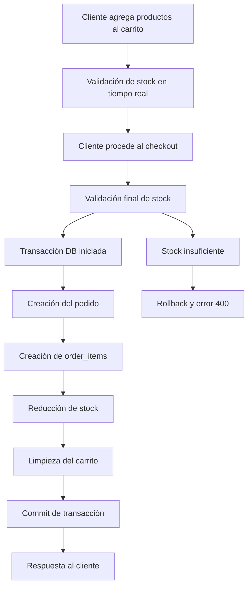

# NAVYS Laravel - E-commerce Backend API

## 📋 Descripción del Proyecto

NAVYS Laravel es una API REST completa para un sistema de e-commerce desarrollada con Laravel. El sistema maneja usuarios con diferentes roles, catálogo de productos, carrito de compras, lista de favoritos y gestión completa de pedidos.

## 🚀 Características Principales

### 👥 Gestión de Usuarios
- **Autenticación**: Registro, login y logout con Laravel Sanctum
- **Roles**: Admin, Empleado y Cliente con permisos diferenciados
- **Perfiles**: Gestión completa de datos personales y fotos de perfil
- **Seguridad**: Rate limiting y validaciones robustas

### 🛍️ Catálogo de Productos
- **CRUD Completo**: Crear, leer, actualizar y eliminar productos
- **Imágenes Múltiples**: Soporte para múltiples imágenes por producto
- **Variaciones**: Manejo de tallas, colores y tipos
- **Inventario**: Control de stock en tiempo real
- **Búsqueda**: Filtros por categoría, tipo y búsqueda de texto

### 🛒 Carrito de Compras
- **Gestión Completa**: Agregar, actualizar, eliminar productos
- **Variaciones**: Soporte para tallas y colores específicos
- **Validaciones**: Verificación de stock disponible
- **Persistencia**: Carrito vinculado al usuario autenticado

### ❤️ Lista de Favoritos
- **Wishlist Personal**: Cada usuario mantiene su lista de favoritos
- **Gestión Simple**: Agregar/quitar productos de favoritos
- **Verificación**: Endpoint para verificar si un producto está en favoritos

### 📦 Gestión de Pedidos
- **Flujo Completo**: Desde carrito hasta entrega
- **Estados**: Pendiente, Confirmado, En Proceso, Enviado, Entregado, Cancelado
- **Información Detallada**: Datos de envío, pago y productos
- **Panel Admin**: Gestión administrativa de todos los pedidos

## 🏗️ Arquitectura del Sistema

### Modelos Principales
- **User**: Usuarios con roles diferenciados
- **Product**: Catálogo de productos con variaciones
- **CartItem**: Items del carrito de compras
- **Favorite**: Lista de productos favoritos
- **Order**: Pedidos con información completa
- **OrderItem**: Detalles de productos en cada pedido

### Controladores
- **AuthController**: Autenticación y gestión de sesiones
- **UserController**: CRUD de usuarios
- **ProductController**: Gestión del catálogo
- **CartController**: Operaciones del carrito
- **FavoriteController**: Gestión de favoritos
- **OrderController**: Procesamiento de pedidos
- **AdminController**: Panel administrativo

## 🔧 Tecnologías Utilizadas

- **Framework**: Laravel 10+
- **Autenticación**: Laravel Sanctum
- **Base de Datos**: MySQL con migraciones
- **Almacenamiento**: Local + Firebase (fallback)
- **Validación**: Form Requests y Validators
- **API**: RESTful con respuestas JSON estandarizadas

## 📊 Base de Datos

### Tablas Principales
- `users`: Información de usuarios y roles
- `products`: Catálogo con imágenes y variaciones
- `cart_items`: Items del carrito por usuario
- `favorites`: Productos favoritos por usuario
- `orders`: Pedidos con información completa
- `order_items`: Detalles de productos en pedidos
- `personal_access_tokens`: Tokens de autenticación
- `sessions`: Sesiones de usuario

## 🛡️ Seguridad

- **Rate Limiting**: Protección contra ataques de fuerza bruta
- **Validación Robusta**: Validación de todos los inputs
- **Autenticación**: Tokens seguros con Sanctum
- **Autorización**: Middleware de roles y permisos
- **Sanitización**: Limpieza de datos de entrada

## 📱 API Endpoints

### Autenticación
- `POST /api/register` - Registro de usuarios
- `POST /api/login` - Inicio de sesión
- `POST /api/logout` - Cerrar sesión
- `GET /api/me` - Información del usuario actual

### Productos
- `GET /api/products` - Listar productos (público)
- `GET /api/products/{id}` - Ver producto específico
- `POST /api/products` - Crear producto (admin/empleado)
- `PUT /api/products/{id}` - Actualizar producto
- `DELETE /api/products/{id}` - Eliminar producto

### Carrito
- `GET /api/cart` - Ver carrito
- `POST /api/cart` - Agregar al carrito
- `PUT /api/cart/{id}` - Actualizar cantidad
- `DELETE /api/cart/{id}` - Eliminar item
- `DELETE /api/cart` - Limpiar carrito

### Favoritos
- `GET /api/favorites` - Ver favoritos
- `POST /api/favorites` - Agregar a favoritos
- `DELETE /api/favorites/{productId}` - Quitar de favoritos
- `GET /api/favorites/check/{productId}` - Verificar favorito

### Pedidos
- `GET /api/orders` - Mis pedidos
- `POST /api/orders` - Crear pedido
- `GET /api/orders/{id}` - Ver pedido específico
- `PUT /api/orders/{id}/cancel` - Cancelar pedido

### Administración
- `GET /api/admin/orders` - Todos los pedidos (admin)
- `PUT /api/admin/orders/{id}/status` - Actualizar estado

# NAVYS Laravel Backend

Sistema de e-commerce desarrollado con Laravel que proporciona una API REST completa para la gestión de productos, usuarios, pedidos y carrito de compras.
# NAVYS Laravel Backend

Sistema de e-commerce desarrollado con Laravel que proporciona una API REST completa para la gestión de productos, usuarios, pedidos y carrito de compras.

## 🚀 Instalación y Configuración

1. **Clonar el repositorio**
\`\`\`bash
git clone https://github.com/YayisTorres/NAVYSlaravel
cd NAVYSlaravel
\`\`\`

2. **Instalar dependencias**
\`\`\`bash
composer install
\`\`\`

3. **Configurar entorno**
\`\`\`bash
cp .env.example .env
php artisan key:generate
\`\`\`

4. **Configurar base de datos**
\`\`\`bash
php artisan migrate
\`\`\`

5. **Iniciar servidor**
\`\`\`bash
php artisan serve
\`\`\`

## 📈 Estado del Proyecto

El proyecto está en desarrollo activo con las siguientes características implementadas:

- ✅ Sistema de autenticación completo
- ✅ Gestión de usuarios y roles
- ✅ Catálogo de productos con imágenes
- ✅ Carrito de compras funcional
- ✅ Sistema de favoritos
- ✅ Procesamiento de pedidos
- ✅ Panel administrativo básico
- ✅ API REST completa

## 🤝 Contribución

Este es un proyecto en desarrollo. Para contribuir:

1. Fork el repositorio
2. Crea una rama para tu feature
3. Realiza tus cambios
4. Envía un pull request

## 📄 Licencia

Proyecto desarrollado para fines educativos y comerciales.

---
## 🏗️ Arquitectura General

El backend de NAVYS Laravel sigue el patrón MVC (Model-View-Controller) de Laravel, implementando una API REST completa para un sistema de e-commerce. La arquitectura se basa en:

- **Modelos Eloquent** para la interacción con la base de datos
- **Controladores** que manejan la lógica de negocio
- **Middleware** para autenticación y autorización
- **Servicios** para funcionalidades específicas como subida de imágenes
- **Migraciones** para el versionado de la base de datos

## 🗄️ Estructura de Base de Datos

### Tabla Users

La tabla de usuarios maneja tres tipos de roles con campos específicos:

\`\`\`php
Schema::create('users', function (Blueprint $table) {
    $table->id();
    $table->string('email')->unique();
    $table->string('password');
    $table->string('name');
    $table->string('lastName');
    $table->string('middleName')->nullable();
    $table->string('numberPhone')->nullable();
    $table->string('photo')->nullable();
    $table->enum('role', ['admin', 'empleado', 'cliente'])->default('cliente');
    $table->timestamps();
});
\`\`\`

### Tabla Products

Los productos utilizan UUID como clave primaria y almacenan datos complejos en JSON:

\`\`\`php
Schema::create('products', function (Blueprint $table) {
    $table->uuid('id')->primary();
    $table->string('code')->unique();
    $table->string('name');
    $table->json('images')->nullable(); // Múltiples imágenes por color
    $table->json('sizes')->nullable();  // Array de tallas disponibles
    $table->json('size2')->nullable(); // Tallas secundarias
    $table->decimal('price', 10, 2);
    $table->integer('quantity')->default(0);
    // ... más campos
});
\`\`\`

### Relaciones Críticas

El sistema maneja relaciones complejas entre usuarios y productos:

\`\`\`php
// Cart Items - Relación con variaciones
$table->unique(['user_id', 'product_id', 'size', 'color']);

// Orders - Información completa del pedido
$table->uuid('id')->primary();
$table->unsignedBigInteger('user_id');
$table->enum('status', ['pending', 'confirmed', 'processing', 'shipped', 'delivered', 'cancelled']);
\`\`\`

## 🔐 Sistema de Autenticación

### Registro y Login

El sistema utiliza Laravel Sanctum para autenticación basada en tokens:

\`\`\`php
public function login(Request $request)
{
    $user = User::where('email', $request->email)->first();
    
    if (!$user || !Hash::check($request->password, $user->password)) {
        return response()->json([
            'success' => false,
            'message' => 'Credenciales incorrectas'
        ], 401);
    }
    
    $token = $user->createToken('auth_token')->plainTextToken;
    
    return response()->json([
        'success' => true,
        'data' => ['user' => $user, 'token' => $token]
    ]);
}
\`\`\`

### Middleware de Roles

El sistema implementa autorización basada en roles:

\`\`\`php
// En api.php
Route::middleware('role:admin,empleado')->group(function () {
    Route::post('/products', [ProductController::class, 'store']);
    Route::put('/products/{id}', [ProductController::class, 'update']);
});
\`\`\`

## 🛍️ Gestión de Productos

### Almacenamiento de Imágenes

El sistema implementa un servicio híbrido para imágenes (local + Firebase):

\`\`\`php
public function store(Request $request)
{
    $images = [];
    if ($request->hasFile('images')) {
        foreach ($request->file('images') as $color => $image) {
            $imageName = time() . '_' . $color . '_' . $image->getClientOriginalName();
            $imagePath = $this->imageUploadService->upload($image, 'img/imgProducts', $imageName);
            $images[$color] = $imagePath;
        }
    }
    $productData['images'] = json_encode($images);
}
\`\`\`

### Procesamiento de Datos JSON

Los productos manejan datos complejos que se almacenan como JSON:

\`\`\`php
public function show($id)
{
    $product = Product::find($id);
    
    // Decodificar imágenes si están en JSON
    if ($product->images && is_string($product->images)) {
        $product->images = json_decode($product->images, true);
    }
    
    // Decodificar tallas
    if ($product->sizes && is_string($product->sizes)) {
        $product->sizes = json_decode($product->sizes, true);
    }
}
\`\`\`

## 🛒 Sistema de Carrito

### Lógica de Agregado

El carrito maneja variaciones de productos y validación de stock:

\`\`\`php
public function store(Request $request)
{
    // Verificar stock disponible
    if ($product->quantity < $quantity) {
        return response()->json([
            'success' => false,
            'message' => 'Stock insuficiente. Disponible: ' . $product->quantity
        ], 400);
    }
    
    // Verificar si ya existe el mismo item
    $existingItem = CartItem::where('user_id', $userId)
        ->where('product_id', $productId)
        ->where('size', $size)
        ->where('color', $color)
        ->first();
        
    if ($existingItem) {
        $existingItem->update(['quantity' => $existingItem->quantity + $quantity]);
    } else {
        CartItem::create([
            'user_id' => $userId,
            'product_id' => $productId,
            'quantity' => $quantity,
            'size' => $size,
            'color' => $color,
            'price' => $product->price
        ]);
    }
}
\`\`\`

### Cálculo de Totales

El sistema calcula totales dinámicamente:

\`\`\`php
public function index()
{
    $cartItems = CartItem::with(['product'])
        ->where('user_id', $user->id)
        ->get();
        
    $total = 0;
    $cartItems->each(function ($item) use (&$total) {
        $total += $item->subtotal; // Accessor en el modelo
    });
    
    return response()->json([
        'data' => [
            'items' => $cartItems,
            'total' => number_format($total, 2),
            'count' => $cartItems->sum('quantity')
        ]
    ]);
}
\`\`\`

## 📦 Procesamiento de Pedidos

### Creación de Pedidos

El proceso de pedido es transaccional y maneja múltiples validaciones:

\`\`\`php
public function store(Request $request)
{
    DB::beginTransaction();
    
    try {
        // Verificar stock para todos los items
        foreach ($cartItems as $cartItem) {
            if ($cartItem->product->quantity < $cartItem->quantity) {
                return response()->json([
                    'success' => false,
                    'message' => "Stock insuficiente para {$cartItem->product->name}"
                ], 400);
            }
        }
        
        // Crear el pedido
        $order = Order::create([
            'user_id' => $user->id,
            'status' => 'pending',
            'total' => $total,
            // ... datos de envío
        ]);
        
        // Crear items del pedido y reducir stock
        foreach ($cartItems as $cartItem) {
            OrderItem::create([
                'order_id' => $order->id,
                'product_id' => $cartItem->product->id,
                'quantity' => $cartItem->quantity,
                'unit_price' => $cartItem->price,
                // ... datos del producto al momento de compra
            ]);
            
            $cartItem->product->decrement('quantity', $cartItem->quantity);
        }
        
        // Limpiar carrito
        CartItem::where('user_id', $user->id)->delete();
        
        DB::commit();
        
    } catch (\Exception $e) {
        DB::rollBack();
        throw $e;
    }
}
\`\`\`

### Estados de Pedidos

El sistema maneja un flujo completo de estados:

\`\`\`php
public function updateStatus(Request $request, $id)
{
    $updateData = ['status' => $request->status];
    
    // Actualizar fechas según el estado
    switch ($request->status) {
        case 'confirmed':
            $updateData['confirmed_at'] = now();
            break;
        case 'shipped':
            $updateData['shipped_at'] = now();
            break;
        case 'delivered':
            $updateData['delivered_at'] = now();
            break;
    }
    
    $order->update($updateData);
}
\`\`\`

## ❤️ Sistema de Favoritos

### Gestión Simple y Eficiente

Los favoritos implementan una lógica simple pero robusta:

\`\`\`php
public function store(Request $request)
{
    // Verificar si ya existe
    $existingFavorite = Favorite::where('user_id', $userId)
        ->where('product_id', $productId)
        ->first();
        
    if ($existingFavorite) {
        return response()->json([
            'success' => false,
            'message' => 'El producto ya está en tus favoritos'
        ], 409);
    }
    
    $favorite = Favorite::create([
        'user_id' => $userId,
        'product_id' => $productId
    ]);
}
\`\`\`

## 🔒 Seguridad y Validación

### Rate Limiting

El sistema implementa rate limiting diferenciado:

\`\`\`php
// En api.php
Route::middleware(['throttle:login'])->group(function () {
    Route::post('/login', [AuthController::class, 'login']);
});

Route::middleware(['throttle:api'])->group(function () {
    // Rutas protegidas con límite general
});
\`\`\`

### Validaciones Robustas

Cada endpoint implementa validaciones específicas:

\`\`\`php
$validator = Validator::make($request->all(), [
    'product_id' => 'required|string|exists:products,id',
    'quantity' => 'required|integer|min:1|max:10',
    'size' => 'nullable|string|max:50',
    'color' => 'nullable|string|max:50'
]);

if ($validator->fails()) {
    return response()->json([
        'success' => false,
        'message' => 'Errores de validación',
        'errors' => $validator->errors()
    ], 422);
}
\`\`\`

## 📊 Respuestas Estandarizadas

### Formato Consistente

Todas las respuestas siguen un formato estándar:

\`\`\`php
// Respuesta exitosa
return response()->json([
    'success' => true,
    'message' => 'Operación exitosa',
    'data' => $data
]);

// Respuesta de error
return response()->json([
    'success' => false,
    'message' => 'Error descriptivo',
    'error' => $e->getMessage()
], 500);
\`\`\`

## 🔄 Relaciones y Eager Loading

### Optimización de Consultas

El sistema utiliza eager loading para optimizar consultas:

\`\`\`php
$orders = Order::with(['items.product', 'user'])
    ->where('user_id', $user->id)
    ->recent()
    ->paginate(10);
\`\`\`

## 🛠️ Servicios Auxiliares

### ImageUploadService

Servicio híbrido para manejo de imágenes:

\`\`\`php
// Intenta guardar localmente, fallback a Firebase
$imagePath = $this->imageUploadService->upload($image, 'img/imgProducts', $imageName);


# 🔄 Flujo de Trabajo Técnico

## Arquitectura de Capas

El sistema implementa una arquitectura en capas bien definida:

\`\`\`
┌─────────────────────────────────────┐
│           API Routes Layer          │ ← Definición de endpoints y middleware
├─────────────────────────────────────┤
│         Controllers Layer           │ ← Lógica de negocio y validaciones
├─────────────────────────────────────┤
│          Services Layer             │ ← Servicios especializados (ImageUpload)
├─────────────────────────────────────┤
│           Models Layer              │ ← Eloquent ORM y relaciones
├─────────────────────────────────────┤
│         Database Layer              │ ← MySQL con migraciones versionadas
└─────────────────────────────────────┘
\`\`\`

## Flujo de Autenticación y Autorización

\`\`\`php
// 1. Request llega al middleware de autenticación
Route::middleware(['auth:sanctum'])->group(function () {
    // 2. Sanctum valida el token Bearer
    // 3. Se inyecta el usuario autenticado
    // 4. Middleware de roles verifica permisos
    Route::middleware('role:admin,empleado')->group(function () {
        // 5. Controlador ejecuta lógica de negocio
    });
});


## Ciclo de Vida de un Pedido


## Gestión de Estado de Productos

El sistema maneja el estado de productos a través de múltiples capas:

```php
// 1. Validación de entrada
$validator = Validator::make($request->all(), [
    'images.*' => 'image|mimes:jpeg,png,jpg,gif,webp|max:2048'
]);

// 2. Procesamiento de datos complejos
$productData['images'] = json_encode($images);
$productData['sizes'] = json_encode($request->sizes);

// 3. Persistencia con UUID
$productData['id'] = Str::uuid();
$product = Product::create($productData);

// 4. Respuesta estandarizada
return response()->json([
    'success' => true,
    'data' => $product
], 201);
```
## Sistema de Rate Limiting Diferenciado

```php
// Configuración en RouteServiceProvider
RateLimiter::for('login', function (Request $request) {
    return Limit::perMinute(5)->by($request->ip());
});

RateLimiter::for('api', function (Request $request) {
    return Limit::perMinute(60)->by($request->user()?->id ?: $request->ip());
});

// Aplicación en rutas
Route::middleware(['throttle:login'])->group(function () {
    Route::post('/login', [AuthController::class, 'login']);
});
```

## Patrón de Respuesta Consistente

```php
// Trait para estandarizar respuestas
trait ApiResponseTrait
{
    protected function successResponse($data, $message = 'Operación exitosa', $code = 200)
    {
        return response()->json([
            'success' => true,
            'message' => $message,
            'data' => $data
        ], $code);
    }

    protected function errorResponse($message, $code = 500, $errors = null)
    {
        $response = [
            'success' => false,
            'message' => $message
        ];

        if ($errors) {
            $response['errors'] = $errors;
        }

        return response()->json($response, $code);
    }
}
```
# Conclusión Técnica

NAVYS Laravel representa una implementación robusta y escalable de un sistema e-commerce backend, diseñado con las mejores prácticas de desarrollo Laravel. El sistema destaca por:

## Fortalezas Arquitectónicas

**Separación de Responsabilidades**: Cada componente tiene una responsabilidad específica y bien definida, desde los controladores que manejan la lógica de negocio hasta los servicios especializados como `ImageUploadService`.

**Integridad de Datos**: El uso extensivo de transacciones de base de datos garantiza la consistencia, especialmente en operaciones críticas como la creación de pedidos donde múltiples tablas deben actualizarse de forma atómica.

**Escalabilidad**: La implementación de UUID para productos, índices estratégicos, eager loading y paginación prepara el sistema para manejar grandes volúmenes de datos sin degradación del rendimiento.

## Fortalezas Arquitectónicas

**Separación de Responsabilidades**: Cada componente tiene una responsabilidad específica y bien definida, desde los controladores que manejan la lógica de negocio hasta los servicios especializados como `ImageUploadService`.

**Integridad de Datos**: El uso extensivo de transacciones de base de datos garantiza la consistencia, especialmente en operaciones críticas como la creación de pedidos donde múltiples tablas deben actualizarse de forma atómica.

**Escalabilidad**: La implementación de UUID para productos, índices estratégicos, eager loading y paginación prepara el sistema para manejar grandes volúmenes de datos sin degradación del rendimiento.

**Seguridad Multicapa**: Desde rate limiting diferenciado hasta validaciones exhaustivas y middleware de autorización basado en roles, el sistema implementa defensa en profundidad.

## Decisiones de Diseño Destacables

**Flexibilidad de Productos**: El uso de campos JSON para imágenes, tallas y variaciones permite una gran flexibilidad sin comprometer la estructura relacional de la base de datos.

**Gestión Híbrida de Archivos**: La implementación de almacenamiento local con fallback automático a Firebase garantiza disponibilidad y redundancia.

**API RESTful Consistente**: Todas las respuestas siguen un formato estándar que facilita la integración con frontends y aplicaciones móviles.

## Preparación para Producción

El sistema está diseñado pensando en un entorno de producción real:

- **Manejo de Errores**: Captura y logging comprehensivo de excepciones
- **Validaciones Robustas**: Validación tanto a nivel de controlador como de base de datos
- **Optimización de Consultas**: Prevención de problemas N+1 y uso eficiente de índices
- **Transacciones Atómicas**: Garantía de consistencia en operaciones complejas

  ## Potencial de Extensión

La arquitectura modular permite extensiones futuras como:

- Integración con pasarelas de pago
- Sistema de notificaciones en tiempo real
- Analytics y reportes avanzados
- API para aplicaciones móviles
- Integración con sistemas de inventario externos


NAVYS Laravel no es solo un backend funcional, sino una base sólida para un ecosistema e-commerce completo que puede evolucionar con las necesidades del negocio manteniendo la calidad, seguridad y rendimiento.
